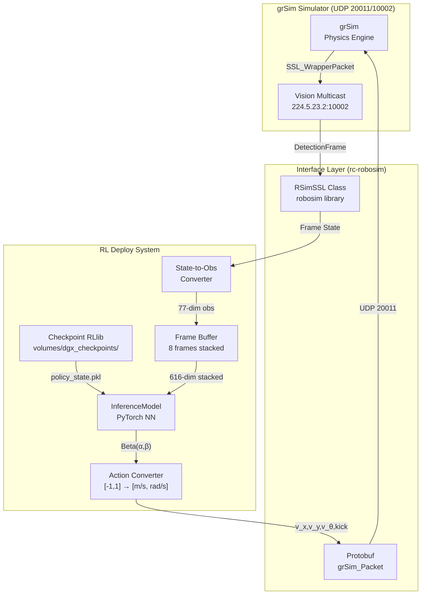
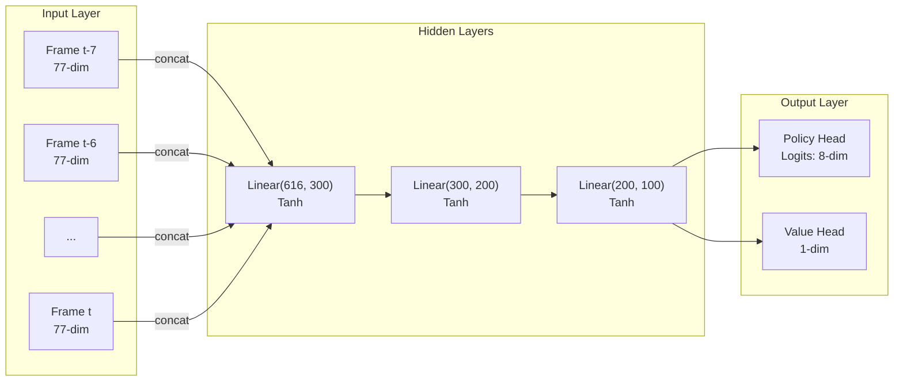
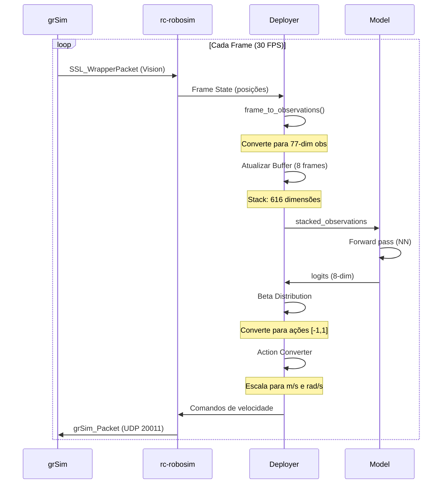

# Guia de Deploy de Policies no grSim

## Resumo Executivo

**As policies treinadas neste repositório PODEM ser implantadas no grSim**, o simulador oficial da RoboCup Small Size League (SSL).

Este guia documenta os requisitos, arquitetura e passos necessários para fazer deploy das policies treinadas usando Ray RLlib no grSim.

---

## Arquitetura do Sistema

### Diagrama de Fluxo de Dados



### Componentes Principais

#### 1. Modelo de Inferência (`scripts/model/model_inferece.py`)



**Especificações:**
- **Input**: 616 dimensões (8 frames × 77 features)
- **Hidden Layers**: [300, 200, 100] com ativação Tanh
- **Output**: 8 dimensões (2 robôs × 4 ações: v_x, v_y, v_theta, kick)
- **Distribuição**: Beta Distribution para ações contínuas em [-1, 1]

#### 2. Conversão de Estado (`scripts/sim2real/state_to_obs.py`)

A conversão transforma o estado físico do grSim em observações de 77 dimensões:

| Componente | Dimensões | Descrição |
|------------|-----------|-----------|
| Posições | 14 | (x,y) de 6 robôs + bola, normalizado em [-1,1] |
| Orientações | 18 | (sin, cos, theta) de 6 robôs |
| Distâncias | 8 | Distâncias bola-gol, robô-bola, robô-robô |
| Ângulos | 24 | Ângulos entre robôs, bola e gols |
| Ações Anteriores | 12 | 3 robôs × 4 ações anteriores |
| Tempo Restante | 1 | Normalizado [0,1] |
| **Total** | **77** | - |

#### 3. Estrutura dos Checkpoints

```
volumes/dgx_checkpoints/
└── PPO_selfplay_rec/
    └── PPO_Soccer_baseline_2025-03-16/
        └── checkpoint_000003/
            ├── algorithm_state.pkl          # Estado completo (79KB)
            ├── rllib_checkpoint.json        # Metadados
            └── policies/
                ├── policy_blue/
                │   ├── policy_state.pkl   # Pesos PyTorch (6.4MB)
                │   └── rllib_checkpoint.json
                └── policy_yellow/
                    └── ...
```

---

## Requisitos

### Hardware

| Componente | Mínimo | Recomendado |
|------------|--------|-------------|
| CPU | 4 cores | 8+ cores |
| RAM | 8 GB | 16 GB |
| GPU | Opcional | NVIDIA com CUDA 11.8+ |
| Disco | 10 GB | 20 GB (com checkpoints) |
| Rede | UDP local | UDP multicast suportado |

### Software

| Componente | Versão | Propósito |
|------------|--------|-----------|
| Python | 3.10+ | Runtime principal |
| PyTorch | 2.0+ | Inferência do modelo |
| Ray RLlib | 2.10.0 | Carregamento de checkpoints |
| rc-robosim | Latest | Interface com grSim |
| Protobuf | 3.x+ | Protocolo de comunicação |
| Docker | 20.10+ | Opcional, para grSim |

### Dependências Python

```txt
# requirements.txt (existente)
torch>=2.0.0
ray[rllib]==2.10.0
gymnasium>=0.28.0
numpy>=1.24.0
pyyaml>=6.0
protobuf>=3.20.0
robosim>=0.0.1  # rc-robosim
```

---

## Instalação e Setup

### Opção 1: Setup Nativo

```bash
# 1. Clonar o repositório (já existente)
cd /home/marcos-paulo/Documentos/RL

# 2. Criar ambiente virtual
python -m venv venv
source venv/bin/activate

# 3. Instalar dependências
pip install -r requirements.txt

# 4. Instalar rc-robosim (se não estiver no requirements)
pip install robosim
```

### Opção 2: Setup com Docker (Recomendado)

#### Docker Compose Completo

```yaml
# docker-compose.grsim.yml
version: '3.8'

services:
  grsim:
    image: robocupssl/grsim:latest
    container_name: grsim_simulator
    ports:
      - "20011:20011/udp"  # Comandos
      - "8080:8080"        # Interface web (se disponível)
    environment:
      - DISPLAY=:0
    volumes:
      - /tmp/.X11-unix:/tmp/.X11-unix:rw
    network_mode: host
    command: >
      sh -c "grSim --headless false
             --vision-port 10002
             --command-port 20011
             --vision-multicast true
             --vision-multicast-address 224.5.23.2"

  rl_policy:
    build:
      context: .
      dockerfile: Dockerfile.policy
    container_name: rl_policy_deploy
    depends_on:
      - grsim
    volumes:
      - ./volumes/dgx_checkpoints:/checkpoints:ro
      - ./scripts:/app/scripts:ro
    environment:
      - CHECKPOINT_PATH=/checkpoints/PPO_selfplay_rec/PPO_Soccer_baseline_2025-03-16/checkpoint_000003
      - GRSIM_HOST=host.docker.internal
      - GRSIM_PORT=20011
      - VISION_ADDRESS=224.5.23.2
      - VISION_PORT=10002
    network_mode: host
    command: python deploy_policy.py
```

#### Dockerfile para Deploy da Policy

```dockerfile
# Dockerfile.policy
FROM python:3.10-slim

# Instalar dependências do sistema
RUN apt-get update && apt-get install -y \
    build-essential \
    libprotobuf-dev \
    protobuf-compiler \
    && rm -rf /var/lib/apt/lists/*

# Diretório de trabalho
WORKDIR /app

# Copiar dependências
COPY requirements.txt .
RUN pip install --no-cache-dir -r requirements.txt

# Copiar código
COPY scripts/ ./scripts/
COPY observations.py rewards.py config.yaml ./

# Script de deploy
COPY deploy_policy.py .

# Variáveis de ambiente
ENV PYTHONUNBUFFERED=1
ENV CUDA_VISIBLE_DEVICES=""

CMD ["python", "deploy_policy.py"]
```

### Executar com Docker

```bash
# Iniciar grSim e o deploy da policy
docker-compose -f docker-compose.grsim.yml up

# Ou apenas o grSim (para testes manuais)
docker run -it --rm --network host \
    -e DISPLAY=$DISPLAY \
    -v /tmp/.X11-unix:/tmp/.X11-unix \
    robocupssl/grsim:latest
```

---

## Implementação do Deploy

### Script de Deploy Completo

```python
#!/usr/bin/env python3
"""
Deploy de Policy RL no grSim

Este script carrega um checkpoint RLlib e executa a política
no simulador grSim usando a biblioteca rc-robosim.
"""

import os
import pickle
import yaml
import numpy as np
import torch
import torch.nn as nn
from pathlib import Path

# Importar componentes do repositório
from scripts.model.model_inferece import InferenceModel
from scripts import InferenceBetaDist
from scripts.sim2real.state_to_obs import frame_to_observations
from scripts.sim2real.config import (
    FIELD_LENGTH, FIELD_WIDTH, N_ROBOTS_BLUE,
    N_ROBOTS_YELLOW, MAX_EP_LENGTH, GOAL, BALL, ROBOT
)

# Tentar importar rc-robosim
try:
    import robosim
except ImportError:
    print("Erro: rc-robosim não instalado. Instale com: pip install robosim")
    raise


class GrSimDeployer:
    """
    Classe principal para deploy de policies no grSim.
    """

    def __init__(
        self,
        checkpoint_path: str,
        team: str = "blue",
        field_type: int = 1,  # 0=6vs6, 1=11vs11, 2=hardware
        n_robots_blue: int = 3,
        n_robots_yellow: int = 3,
        fps: int = 30,
        device: str = None
    ):
        """
        Inicializa o deployer.

        Args:
            checkpoint_path: Caminho para o checkpoint RLlib
            team: Time controlado ('blue' ou 'yellow')
            field_type: Tipo de campo (0, 1, ou 2)
            n_robots_blue: Número de robôs azuis
            n_robots_yellow: Número de robôs amarelos
            fps: Frames por segundo
            device: Dispositivo ('cuda' ou 'cpu')
        """
        self.team = team
        self.n_robots_blue = n_robots_blue
        self.n_robots_yellow = n_robots_yellow
        self.fps = fps
        self.device = device or ("cuda" if torch.cuda.is_available() else "cpu")

        # Carregar modelo
        self.model = self._load_model(checkpoint_path)
        self.model.eval()

        # Inicializar buffer de observações (8 frames empilhados)
        self.obs_size = 77
        self.n_stack = 8
        self.stacked_obs = self._init_stacked_obs()

        # Últimas ações
        self.last_actions = self._init_actions()

        # Inicializar simulador
        self.sim = self._init_simulator(field_type)

        print(f"Deployer inicializado:")
        print(f"  - Checkpoint: {checkpoint_path}")
        print(f"  - Device: {self.device}")
        print(f"  - Team: {team}")
        print(f"  - Robots: {n_robots_blue} blue, {n_robots_yellow} yellow")

    def _load_model(self, checkpoint_path: str) -> InferenceModel:
        """Carrega o modelo do checkpoint RLlib."""
        model = InferenceModel(
            input_size=self.obs_size * self.n_stack,
            output_size=2 * 4  # 2 robôs × 4 ações
        )

        policy_file = Path(checkpoint_path) / "policies/policy_blue/policy_state.pkl"

        if not policy_file.exists():
            raise FileNotFoundError(f"Checkpoint não encontrado: {policy_file}")

        with open(policy_file, "rb") as f:
            policy_state = pickle.load(f)

        # Converter pesos do formato RLlib para PyTorch
        weights_dict = {}
        for layer_name, weights in policy_state["weights"].items():
            split = layer_name.split(".")
            if "_logits" == split[0] or "_value_branch" == split[0]:
                new_layer_name = split[0] + "." + split[-1]
            else:
                new_layer_name = split[0] + "." + str(int(split[1])*2) + "." + split[-1]
            weights_dict[new_layer_name] = torch.tensor(weights)

        model.load_state_dict(weights_dict)
        model.to(self.device)

        return model

    def _init_stacked_obs(self) -> dict:
        """Inicializa o buffer de observações."""
        return {
            **{f"blue_{i}": np.zeros(self.obs_size * self.n_stack, dtype=np.float64)
               for i in range(self.n_robots_blue)},
            **{f"yellow_{i}": np.zeros(self.obs_size * self.n_stack, dtype=np.float64)
               for i in range(self.n_robots_yellow)}
        }

    def _init_actions(self) -> dict:
        """Inicializa as ações."""
        return {
            **{f"blue_{i}": np.zeros(4, dtype=np.float64)
               for i in range(self.n_robots_blue)},
            **{f"yellow_{i}": np.zeros(4, dtype=np.float64)
               for i in range(self.n_robots_yellow)}
        }

    def _init_simulator(self, field_type: int):
        """Inicializa o simulador grSim via rc-robosim."""
        # Posições iniciais
        blue_pos = [[-1.5, 0.0, 0.0], [-2.0, 1.0, 0.0], [-2.0, -1.0, 0.0]]
        yellow_pos = [[1.5, 0.0, 180.0], [2.0, 1.0, 180.0], [2.0, -1.0, 180.0]]

        sim = robosim.SSL(
            field_type=field_type,
            n_robots_blue=self.n_robots_blue,
            n_robots_yellow=self.n_robots_yellow,
            time_step_ms=int(1000 / self.fps),
            ball_pos=[0, 0, 0, 0],  # x, y, vx, vy
            blue_robots_pos=blue_pos[:self.n_robots_blue],
            yellow_robots_pos=yellow_pos[:self.n_robots_yellow]
        )

        return sim

    def _get_frame_state(self) -> dict:
        """Obtém o estado atual do simulador."""
        state = self.sim.get_state()

        # Converter formato rc-robosim para formato do repositório
        frame = {
            "robots_blue": {},
            "robots_yellow": {},
            "ball": [state[0], state[1]]  # x, y da bola
        }

        # Extrair posições dos robôs do estado
        # Formato depende da implementação específica do rc-robosim
        for i in range(self.n_robots_blue):
            idx = 4 + i * 3  # offset após bola
            frame["robots_blue"][f"robot_{i}"] = [
                state[idx],      # x
                state[idx + 1],  # y
                state[idx + 2]   # theta
            ]

        for i in range(self.n_robots_yellow):
            idx = 4 + self.n_robots_blue * 3 + i * 3
            frame["robots_yellow"][f"robot_{i}"] = [
                state[idx],
                state[idx + 1],
                state[idx + 2]
            ]

        return frame

    def _convert_observations(self, frame: dict, step: int) -> dict:
        """Converte frame para observações."""
        self.stacked_obs = frame_to_observations(
            frame, self.last_actions, self.stacked_obs
        )
        return self.stacked_obs

    def _compute_actions(self, observations: dict) -> dict:
        """Computa ações usando o modelo."""
        # Preparar input para o modelo (apenas robôs do time controlado)
        model_input = []
        robot_names = []

        for robot_name in observations.keys():
            if self.team in robot_name:
                model_input.append(observations[robot_name])
                robot_names.append(robot_name)

        if not model_input:
            return {}

        # Executar modelo
        model_input = torch.tensor(
            np.array(model_input, dtype=np.float32)
        ).to(self.device)

        with torch.no_grad():
            model_output, _ = self.model(model_input)

        # Aplicar distribuição Beta
        signal = [-1, 1, -1, 1] if self.team == "yellow" else [1, 1, 1, 1]
        distribution = InferenceBetaTest(model_output, signal=signal)
        actions = distribution.sample().detach().cpu().numpy()

        # Mapear ações para robôs
        action_dict = {}
        for i, robot_name in enumerate(robot_names):
            action_dict[robot_name] = actions[i].tolist()

        return action_dict

    def _send_commands(self, actions: dict):
        """Envia comandos para o simulador."""
        # Converter ações [-1, 1] para comandos de velocidade
        # Mapeamento: [-1, 1] → [-5, 5] m/s linear, [-20, 20] rad/s angular
        max_linear = 5.0  # m/s
        max_angular = 20.0  # rad/s
        kick_speed = 3.0  # m/s

        # Preparar comandos para todos os robôs
        commands = np.zeros(
            (self.n_robots_blue + self.n_robots_yellow, 8),
            dtype=np.float64
        )

        # Preencher comandos do time controlado
        for robot_name, action in actions.items():
            color, idx = robot_name.split("_")
            idx = int(idx)

            if color == "blue":
                rbt_id = idx
            else:
                rbt_id = self.n_robots_blue + idx

            v_x = action[0] * max_linear
            v_y = action[1] * max_linear
            v_theta = action[2] * max_angular
            kick = 1.0 if action[3] > 0.5 else 0.0

            # Formato: [wheel_speed_flag, v_x/wheel0, v_y/wheel1, v_theta/wheel2,
            #           wheel3, kick_v_x, kick_v_z, dribbler]
            commands[rbt_id] = [
                0,           # wheel_speed (0 = usar velocidades globais)
                v_x,         # v_x
                v_y,         # v_y
                v_theta,     # v_theta
                0,           # reservado
                kick * kick_speed,  # kick_v_x
                0,           # kick_v_z (chip kick)
                0            # dribbler
            ]

        # Enviar para simulador
        self.sim.step(commands)

    def run_episode(self, max_steps: int = None) -> dict:
        """
        Executa um episódio completo.

        Args:
            max_steps: Número máximo de steps (None = usar MAX_EP_LENGTH)

        Returns:
            Estatísticas do episódio
        """
        max_steps = max_steps or MAX_EP_LENGTH
        step = 0
        done = False

        # Resetar simulador
        self.sim.reset()
        self.stacked_obs = self._init_stacked_obs()
        self.last_actions = self._init_actions()

        print(f"Iniciando episódio (max_steps={max_steps})")

        while not done and step < max_steps:
            # 1. Obter estado atual
            frame = self._get_frame_state()

            # 2. Converter para observações
            observations = self._convert_observations(frame, step)

            # 3. Computar ações
            actions = self._compute_actions(observations)

            # 4. Atualizar últimas ações
            self.last_actions.update(actions)

            # 5. Enviar comandos para simulador
            self._send_commands(actions)

            step += 1

            # Verificar condições de término (gol, fora de campo, etc.)
            # TODO: Implementar verificação de gol usando o frame

        print(f"Episódio finalizado após {step} steps")

        return {
            "steps": step,
            "final_actions": self.last_actions
        }

    def run_continuous(self):
        """Executa continuamente até interrupção."""
        print("Executando em modo contínuo (Ctrl+C para parar)")
        step = 0

        try:
            while True:
                frame = self._get_frame_state()
                observations = self._convert_observations(frame, step)
                actions = self._compute_actions(observations)
                self.last_actions.update(actions)
                self._send_commands(actions)
                step += 1

        except KeyboardInterrupt:
            print(f"\nExecução interrompida após {step} steps")


def main():
    """Função principal."""
    # Carregar configurações
    with open("config.yaml") as f:
        config = yaml.safe_load(f)

    # Caminho do checkpoint (usar checkpoint existente)
    checkpoint_path = os.environ.get(
        "CHECKPOINT_PATH",
        "volumes/dgx_checkpoints/PPO_selfplay_rec/PPO_Soccer_baseline_2025-03-16/checkpoint_000003"
    )

    # Criar deployer
    deployer = GrSimDeployer(
        checkpoint_path=checkpoint_path,
        team="blue",
        field_type=config["env"]["field_type"],
        n_robots_blue=3,
        n_robots_yellow=3,
        fps=config["env"]["fps"]
    )

    # Executar
    deployer.run_continuous()


if __name__ == "__main__":
    main()
```

### Script Simplificado (Sem Docker)

```python
#!/usr/bin/env python3
"""
Deploy simplificado para testes rápidos.
"""

import pickle
import numpy as np
import torch
from pathlib import Path

from scripts.model.model_inferece import InferenceModel
from scripts import InferenceBetaDist


def deploy_simple(checkpoint_path: str):
    """Deploy simplificado para demonstração."""

    # 1. Carregar modelo
    model = InferenceModel(input_size=616, output_size=8)

    policy_file = Path(checkpoint_path) / "policies/policy_blue/policy_state.pkl"
    with open(policy_file, "rb") as f:
        policy_state = pickle.load(f)

    weights_dict = {}
    for layer_name, weights in policy_state["weights"].items():
        split = layer_name.split(".")
        if "_logits" == split[0] or "_value_branch" == split[0]:
            new_layer_name = split[0] + "." + split[-1]
        else:
            new_layer_name = split[0] + "." + str(int(split[1])*2) + "." + split[-1]
        weights_dict[new_layer_name] = torch.tensor(weights)

    model.load_state_dict(weights_dict)
    model.eval()

    # 2. Criar observação dummy (exemplo)
    stacked_obs = np.zeros((2, 616), dtype=np.float32)

    # 3. Inferência
    with torch.no_grad():
        output, value = model(torch.tensor(stacked_obs))
        print(f"Modelo carregado com sucesso!")
        print(f"  - Output shape: {output.shape}")
        print(f"  - Value shape: {value.shape}")

    # 4. Aplicar distribuição Beta
    dist = InferenceBetaTest(output, signal=[1, 1, 1, 1])
    actions = dist.sample()
    print(f"  - Ações amostradas: {actions}")

    return model


if __name__ == "__main__":
    checkpoint = "volumes/dgx_checkpoints/PPO_selfplay_rec/PPO_Soccer_baseline_2025-03-16/checkpoint_000003"
    deploy_simple(checkpoint)
```

---

## Fluxo de Execução



---

## Troubleshooting

### Problemas Comuns

#### 1. Erro: "robosim module not found"

**Causa**: Biblioteca rc-robosim não instalada.

**Solução**:
```bash
pip install robosim
# ou
pip install rc-robosim
```

#### 2. Erro: "CUDA out of memory"

**Causa**: GPU sem memória suficiente.

**Solução**:
```python
# Forçar uso de CPU
deployer = GrSimDeployer(
    checkpoint_path=...,
    device="cpu"
)
```

#### 3. Erro: "policy_state.pkl not found"

**Causa**: Caminho do checkpoint incorreto.

**Solução**:
```bash
# Verificar estrutura
ls -la volumes/dgx_checkpoints/*/*/

# Caminho correto deve ser:
# volumes/dgx_checkpoints/<experiment>/<run>/checkpoint_<number>/
```

#### 4. Comportamento errático dos robôs

**Causas possíveis**:
- Buffer de observações não inicializado corretamente
- Escalonamento de ações incorreto
- Frequência de controle diferente do treinamento

**Solução**:
```python
# Verificar configurações
print(f"FPS: {deployer.fps}")  # Deve ser 30
print(f"Stack size: {deployer.n_stack}")  # Deve ser 8

# Resetar buffer
deployer.stacked_obs = deployer._init_stacked_obs()
```

#### 5. grSim não recebe comandos

**Causa**: Problemas de rede/firewall.

**Solução**:
```bash
# Verificar portas UDP
sudo netstat -ulnp | grep -E "20011|10002"

# Testar com netcat
nc -u -v 127.0.0.1 20011

# Verificar se grSim está escutando
sudo tcpdump -i lo udp port 20011
```

#### 6. Erro de shape nas observações

**Causa**: Formato de entrada do modelo incorreto.

**Diagnóstico**:
```python
# Verificar shapes
print(f"Input shape: {model_input.shape}")
print(f"Expected: (n_robots, 616)")

# Verificar buffer
for name, obs in stacked_obs.items():
    print(f"{name}: {obs.shape}")  # Deve ser (616,)
```

### Debug Mode

```python
# Habilitar debug detalhado
import logging
logging.basicConfig(level=logging.DEBUG)

# No deployer, adicionar prints:
def _compute_actions(self, observations):
    print(f"Input shape: {len(observations)}")
    print(f"First obs shape: {list(observations.values())[0].shape}")
    # ... resto do código
```

---

## Limitações e Considerações

### Limitações Conhecidas

1. **rc-robosim Dependency**: A comunicação depende da biblioteca rc-robosim que pode não estar disponível para todas as plataformas.

2. **Stack de Frames**: O modelo requer exatamente 8 frames de histórico. Menos frames resultam em comportamento degradado.

3. **Self-play Training**: Apenas `policy_blue` é treinada ativamente. `policy_yellow` é uma cópia dos pesos de blue em momentos específicos.

4. **Frequência de Controle**: O modelo foi treinado com 30 FPS. Outras frequências podem afetar a performance.

5. **Field Type**: Checkpoints foram treinados com field_type=1 (campo padrão SSL).

### Considerações de Performance

| Métrica | Valor Esperado |
|---------|----------------|
| Latência de Inferência | < 10ms (GPU) / < 50ms (CPU) |
| Throughput | 30 FPS |
| Uso de GPU | ~500MB VRAM |
| Uso de CPU | 1-2 cores |
| Uso de RAM | ~2GB |

### Segurança

- O grSim aceita comandos UDP de qualquer fonte na porta 20011
- Para ambientes de produção, considere:
  - Firewall para restringir acesso à porta 20011
  - Autenticação em camadas superiores
  - Execução em rede isolada

---

## Referências

### Arquivos do Repositório

| Arquivo | Propósito |
|---------|-----------|
| `RL_train.py` | Treinamento PPO com self-play |
| `RL_eval.py` | Avaliação com renderização |
| `RL_infer.py` | Inferência standalone (exemplo) |
| `scripts/model/model_inferece.py` | Modelo PyTorch para deploy |
| `scripts/model/action_dists.py` | Distribuição Beta para ações |
| `scripts/sim2real/state_to_obs.py` | Conversão estado → observação |
| `config.yaml` | Configurações de treinamento |

### Links Úteis

- [grSim GitHub](https://github.com/RoboCup-SSL/grSim)
- [RoboCup SSL Rules](https://robocup-ssl.github.io/ssl-rules/)
- [Ray RLlib Documentation](https://docs.ray.io/en/latest/rllib/index.html)
- [rSoccer Framework](https://github.com/robocin/rSoccer)

---

## Checklist de Deploy

- [ ] grSim instalado e rodando
- [ ] Dependências Python instaladas (`requirements.txt`)
- [ ] Checkpoint válido em `volumes/dgx_checkpoints/`
- [ ] Configuração `config.yaml` compatível
- [ ] Portas UDP 20011 e 10002 disponíveis
- [ ] Teste de conectividade com grSim
- [ ] Modelo carregando sem erros
- [ ] Buffer de observações inicializado
- [ ] Ações dentro do range esperado [-1, 1]
- [ ] Robôs respondendo aos comandos no grSim

---

## Conclusão

O deploy de policies no grSim é **totalmente viável** usando a infraestrutura existente do repositório. A integração via rc-robosim simplifica a comunicação UDP/protobuf, permitindo focar na lógica de inferência do RL.

Para começar:
1. Configure o ambiente (nativo ou Docker)
2. Use o script `deploy_policy.py` como ponto de partida
3. Adapte a conversão de estado conforme necessário
4. Execute e monitore via interface do grSim

Para suporte adicional, consulte os scripts existentes em `RL_infer.py` e `scripts/sim2real/`.
