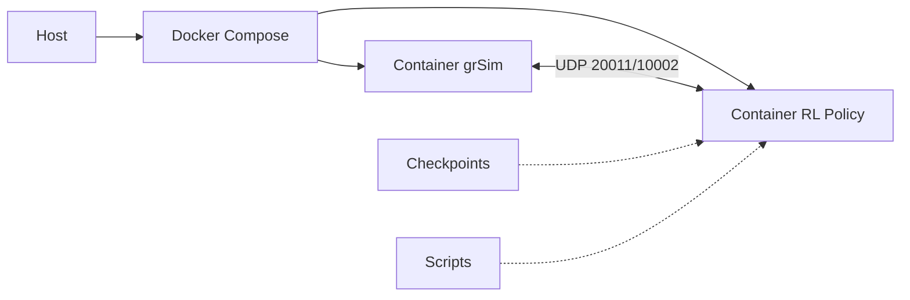

# Guia de Execucao - Pipeline Docker grSim + RL Policy

Este guia contem todos os comandos necessarios para executar as policies treinadas no grSim usando Docker Compose.

---

## Resumo da Pipeline



---

## Pre-requisitos

### 1. Instalar Docker e Docker Compose

```bash
# Verificar instalacao (use o plugin Compose V2: "docker compose", com espaco)
docker --version
docker compose version

# Se aparecer erro KeyError: 'ContainerConfig' ao dar up, voce esta usando o
# docker-compose v1 antigo (Python). Instale o plugin: docker-compose-plugin
# ou use apenas: docker compose ...

# Se nao estiver instalado (Ubuntu/Debian):
curl -fsSL https://get.docker.com -o get-docker.sh
sudo sh get-docker.sh
sudo usermod -aG docker $USER
# Fazer logout e login novamente
```

### 2. Verificar Estrutura do Projeto

```bash
cd /home/marcos-paulo/Documentos/RL

# Verificar arquivos necessarios
ls -la Dockerfile.policy docker-compose.grsim.yml deploy_policy.py
ls -la test_policy.sh stop_policy.sh start_policy.sh
```

### 3. Verificar Checkpoints Disponiveis

```bash
# Listar checkpoints existentes
find volumes/dgx_checkpoints -name "checkpoint_*" -type d

# Exemplo de output:
# volumes/dgx_checkpoints/PPO_selfplay_rec/PPO_Soccer_baseline_2025-03-16/checkpoint_000003
# volumes/dgx_checkpoints/PPO_selfplay_rec/PPO_Soccer_baseline_2025-03-16/checkpoint_000002
# volumes/dgx_checkpoints/PPO_selfplay_rec/PPO_Soccer_baseline_2025-03-16/checkpoint_000001
```

---

## Execucao Rapida (Script Automatizado)

### Usar Checkpoint Padrao

```bash
# Executar script de teste
./test_policy.sh
```

### Usar Checkpoint Especifico

```bash
# Com checkpoint como argumento
./test_policy.sh volumes/dgx_checkpoints/PPO_selfplay_rec/PPO_Soccer_baseline_2025-03-16/checkpoint_000003

# Ou via variavel de ambiente
CHECKPOINT_PATH=volumes/dgx_checkpoints/PPO_selfplay_rec/PPO_Soccer_baseline_2025-03-16/checkpoint_000001 \
    ./test_policy.sh
```

### Parar a Pipeline

```bash
# Em outro terminal ou Ctrl+C no terminal principal
./stop_policy.sh
```

### Subir a Pipeline (alternativa ao comando manual)

```bash
./start_policy.sh
# em background: ./start_policy.sh -d
```

---

## Problema: KeyError 'ContainerConfig' no docker-compose

Se o `docker-compose` (v1, pacote Python) falhar ao recriar o container `rl-policy` apos um build, use **`docker compose`** (v2) ou o script `./start_policy.sh`, que prefere o V2. Opcionalmente remova o container antigo: `docker rm -f rl_policy_deploy` e suba de novo.

---

## Execucao Manual (Comandos Detalhados)

### Passo 1: Ir para o Diretorio do Projeto

```bash
cd /home/marcos-paulo/Documentos/RL
```

### Passo 2: Verificar Checkpoint Exemplo

Vamos usar o checkpoint:
```
volumes/dgx_checkpoints/PPO_selfplay_rec/PPO_Soccer_baseline_2025-03-16/checkpoint_000003
```

Verificar se existe:
```bash
CHECKPOINT_PATH="volumes/dgx_checkpoints/PPO_selfplay_rec/PPO_Soccer_baseline_2025-03-16/checkpoint_000003"

# Verificar estrutura
ls -la ${CHECKPOINT_PATH}/
ls -la ${CHECKPOINT_PATH}/policies/policy_blue/

# Verificar se policy_state.pkl existe
file ${CHECKPOINT_PATH}/policies/policy_blue/policy_state.pkl
```

### Passo 3: Configurar Variaveis de Ambiente (Opcional)

```bash
# Exportar variaveis de configuracao
export CHECKPOINT_PATH="volumes/dgx_checkpoints/PPO_selfplay_rec/PPO_Soccer_baseline_2025-03-16/checkpoint_000003"
export TEAM="blue"
export FPS="30"
export DEVICE="cpu"
export N_ROBOTS_BLUE="3"
export N_ROBOTS_YELLOW="3"

# Verificar
env | grep -E "CHECKPOINT|TEAM|FPS|DEVICE"
```

### Passo 4: Criar Diretorio de Logs

```bash
mkdir -p logs
```

### Passo 5: Iniciar a Pipeline

```bash
# Construir imagens e iniciar containers
docker compose -f docker-compose.grsim.yml up --build
```

#### Modo Detached (Background)

```bash
docker compose -f docker-compose.grsim.yml up --build -d
```

### Passo 6: Verificar Status

```bash
# Ver containers rodando
docker ps

# Ver logs do grSim
docker compose -f docker-compose.grsim.yml logs -f grsim

# Ver logs da policy (em outro terminal)
docker compose -f docker-compose.grsim.yml logs -f rl-policy
```

### Passo 7: Ver Logs em Arquivo

```bash
# Ver arquivo de log da policy
tail -f logs/policy.log
```

### Passo 8: Parar a Pipeline

```bash
# Parar containers
docker compose -f docker-compose.grsim.yml down

# Parar e remover volumes (cuidado - perde dados)
docker compose -f docker-compose.grsim.yml down -v
```

---

## Exemplo Completo: Testando uma Policy

### Cenario: Testar o Checkpoint Baseline

```bash
#!/bin/bash
# Executar este bloco inteiro

cd /home/marcos-paulo/Documentos/RL

# Definir checkpoint
CHECKPOINT="volumes/dgx_checkpoints/PPO_selfplay_rec/PPO_Soccer_baseline_2025-03-16/checkpoint_000003"

echo "=========================================="
echo "Iniciando teste da policy"
echo "Checkpoint: ${CHECKPOINT}"
echo "=========================================="

# 1. Verificar prerequisitos
echo "[1/5] Verificando prerequisitos..."
if [ ! -d "${CHECKPOINT}" ]; then
    echo "ERRO: Checkpoint nao encontrado!"
    exit 1
fi
if [ ! -f "${CHECKPOINT}/policies/policy_blue/policy_state.pkl" ]; then
    echo "ERRO: Arquivo de policy nao encontrado!"
    exit 1
fi
echo "✓ Checkpoint validado"

# 2. Criar diretorio de logs
echo "[2/5] Preparando ambiente..."
mkdir -p logs
echo "✓ Logs prontos"

# 3. Configurar
echo "[3/5] Configurando variaveis..."
export CHECKPOINT_PATH="${CHECKPOINT}"
export TEAM="blue"
export FPS="30"
echo "✓ Configurado"

# 4. Iniciar
echo "[4/5] Iniciando containers..."
echo "✓ Iniciando (Ctrl+C para parar)..."
docker compose -f docker-compose.grsim.yml up --build

# 5. Limpar ao sair
echo "[5/5] Limpando..."
docker compose -f docker-compose.grsim.yml down
echo "✓ Finalizado"
```

---

## Comandos de Debug

### Verificar Rede UDP

```bash
# Ver portas UDP em uso
sudo netstat -ulnp | grep -E "20011|10002"

# Capturar trafego UDP
sudo tcpdump -i lo udp port 20011
sudo tcpdump -i lo udp port 10002
```

### Testar Modelo sem grSim

```bash
# Testar carregamento do checkpoint
docker run --rm -v $(pwd)/volumes/dgx_checkpoints:/checkpoints:ro \
    -e CHECKPOINT_PATH=/checkpoints/PPO_selfplay_rec/PPO_Soccer_baseline_2025-03-16/checkpoint_000003 \
    rl-policy python deploy_policy.py --test-checkpoint
```

### Inspecionar Container

```bash
# Abrir shell no container da policy
docker exec -it rl_policy_deploy /bin/bash

# Dentro do container:
ls -la /checkpoints/
python -c "import torch; print(torch.__version__)"
```

### Rebuild Limpo

```bash
# Parar tudo
docker compose -f docker-compose.grsim.yml down

# Remover imagens
docker rmi rl-policy grsim

# Limpar cache
docker system prune -f

# Reconstruir
docker compose -f docker-compose.grsim.yml up --build
```

---

## Troubleshooting

### Problema: Container grSim nao inicia

```bash
# Verificar logs
docker compose -f docker-compose.grsim.yml logs grsim

# Verificar se porta esta em uso
sudo lsof -i :20011
sudo lsof -i :10002

# Matar processos usando as portas
sudo kill -9 $(sudo lsof -t -i:20011) 2>/dev/null || true
sudo kill -9 $(sudo lsof -t -i:10002) 2>/dev/null || true
```

### Problema: Policy nao conecta ao grSim

```bash
# Verificar se containers estao na mesma rede
docker network ls
docker inspect bridge

# Testar conectividade
docker exec rl_policy_deploy ping grsim
```

### Problema: Checkpoint nao carrega

```bash
# Verificar formato do arquivo
python3 -c "
import pickle
with open('volumes/dgx_checkpoints/PPO_selfplay_rec/PPO_Soccer_baseline_2025-03-16/checkpoint_000003/policies/policy_blue/policy_state.pkl', 'rb') as f:
    data = pickle.load(f)
    print('Chaves:', list(data.keys()))
"
```

---

## Variacoes de Uso

### Testar Time Amarelo

```bash
export TEAM="yellow"
./test_policy.sh
```

### Usar GPU (se disponivel)

```bash
export DEVICE="cuda"
docker compose -f docker-compose.grsim.yml up --build
```

### Alterar Numero de Robos

```bash
export N_ROBOTS_BLUE="2"
export N_ROBOTS_YELLOW="2"
./test_policy.sh
```

### Alterar FPS

```bash
export FPS="60"
./test_policy.sh
```

---

## Resumo dos Arquivos Criados

| Arquivo | Descricao |
|---------|-----------|
| `Dockerfile.policy` | Imagem Docker para a policy RL |
| `docker-compose.grsim.yml` | Orquestracao dos containers |
| `deploy_policy.py` | Script principal de deploy |
| `test_policy.sh` | Script de execucao automatizado |
| `stop_policy.sh` | Script para parar a pipeline |
| `GUIA_EXECUCAO_GRSIM.md` | Este guia |

---

## Proximos Passos

1. **Verificar resultado**: Acesse o grSim para visualizar os robos em acao
2. **Analisar logs**: Verifique `logs/policy.log` para estatisticas
3. **Comparar checkpoints**: Teste diferentes checkpoints para comparar performance
4. **Ajustar parametros**: Modifique FPS, numero de robos, etc.

---

## Recursos Adicionais

- [GRSIM_DEPLOY_GUIDE.md](GRSIM_DEPLOY_GUIDE.md) - Guia tecnico completo
- [grSim Documentation](https://github.com/RoboCup-SSL/grSim)
- [Ray RLlib](https://docs.ray.io/en/latest/rllib/index.html)

---

**Nota**: A GUI do grSim requer X11 forwarding no Linux ou configuracao especial no macOS/Windows.
